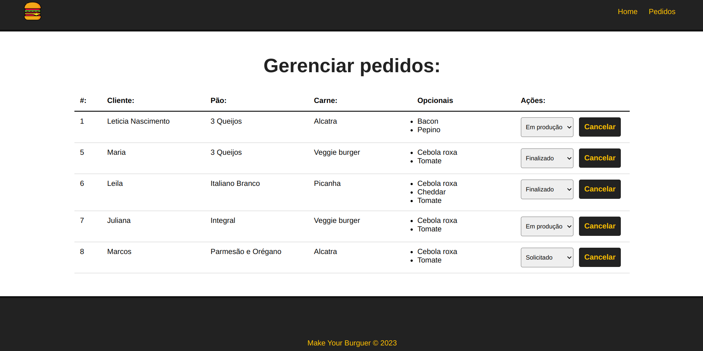
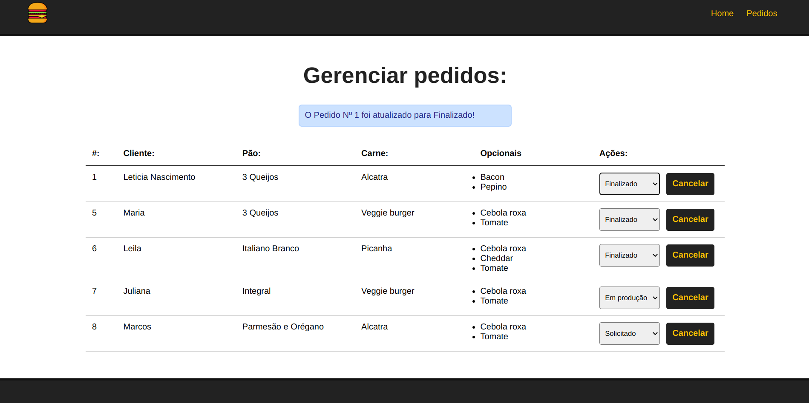
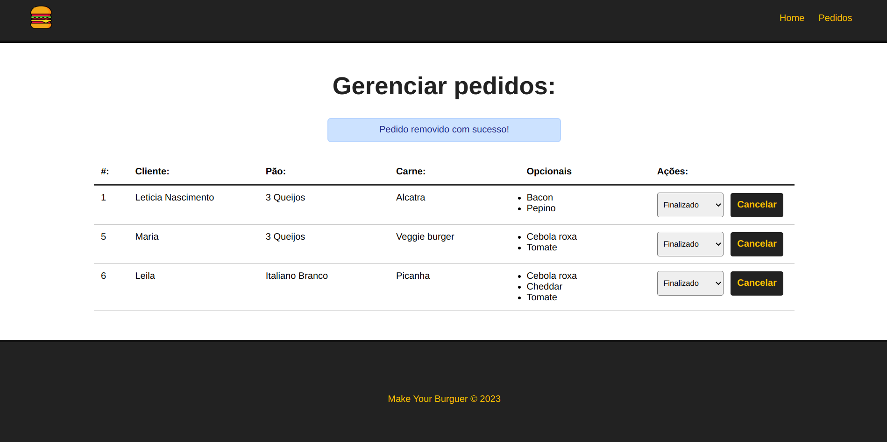

  <a href="#-tecnologias">Tecnologias</a>&nbsp;&nbsp;&nbsp;|&nbsp;&nbsp;&nbsp;
  <a href="#-projeto">Projeto</a>&nbsp;&nbsp;&nbsp;|&nbsp;&nbsp;&nbsp;
  <a href="#-como-rodar">Como rodar</a>&nbsp;&nbsp;&nbsp;|&nbsp;&nbsp;&nbsp;
  <a href="#-como-contribuir">Como contribuir</a>&nbsp;&nbsp;&nbsp;
  

 

  

# Make Yourr Burger

## 🚀 Tecnologias

Esse projeto foi desenvolvido com as seguintes tecnologias:

- [HTML5](https://developer.mozilla.org/pt-BR/docs/Web/HTML)
- [CSS3](https://developer.mozilla.org/pt-BR/docs/Web/CSS)
- [Vue.js](https://br.vuejs.org/)

## 💻 Projeto

Projeto de uma página de hamburgueria para o usuário poder montar seu hambúrguer, com adição do pedido, edição e remoção.

Curso de Vue.js 3 do canal [Matheus Battisti](https://www.youtube.com/watch?v=wsAQQioPIJs&list=PLnDvRpP8BnezDglaAvtWgQXzsOmXUuRHL)

  

  

  

## ⚙️ Como Rodar

- Clone o projeto;
- Rode npm install (ou yarn install de acordo com a sua configuração);
- npm run serve (para rodar o projeto front-end na porta indicada);
- npm run backend (para rodar o projeto back-end na porta indicada);

## 🤔 Como contribuir

- Faça um fork desse repositório;
- Cria uma branch com a sua feature: `git checkout -b minha-feature`;
- Faça commit das suas alterações: `git commit -m 'feat: Minha nova feature'`;
- Faça push para a sua branch: `git push origin minha-feature`.

Depois que o merge da sua pull request for feito, você pode deletar a sua branch.

## 📝 Licença

Esse projeto está sob a licença MIT.
